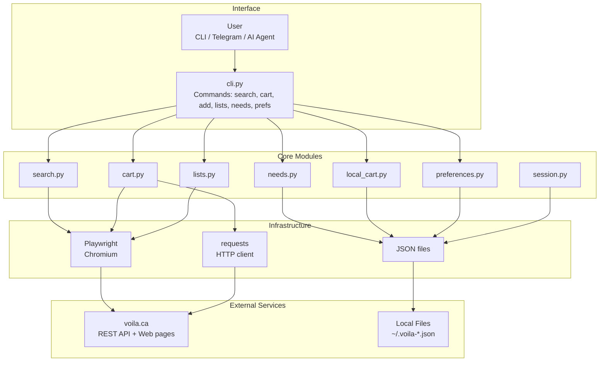
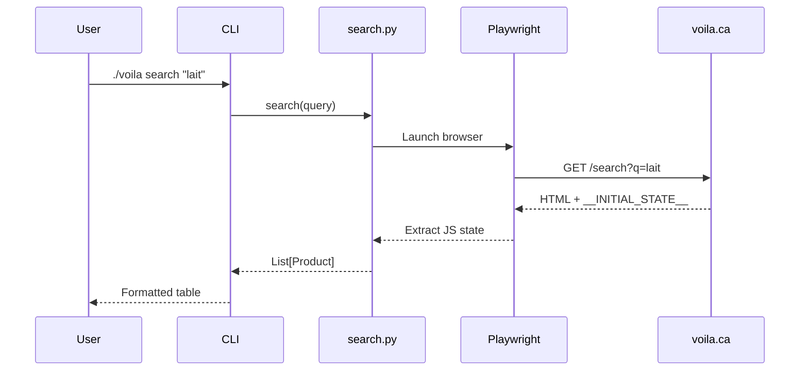
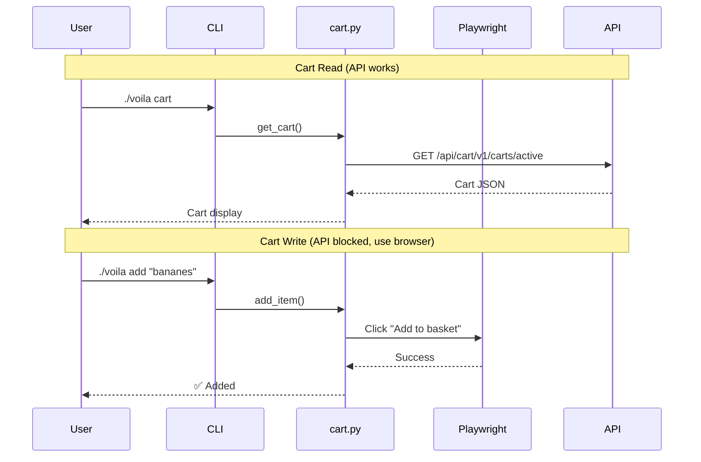

# Architecture

## Overview



## Data Flow

### Product Search



### Cart Operations



### Why Playwright for Writes?

The Voilà REST API returns 403 for cart modification endpoints. Browser automation
is required to interact with the cart through the normal UI flow.

## Key Technical Discoveries

### API Endpoints

| Endpoint | Method | Notes |
|----------|--------|-------|
| `/search?q=<query>` | GET (browser) | Returns page with `__INITIAL_STATE__` |
| `/api/cart/v1/carts/active` | GET | Returns cart JSON |
| `/api/cart/v1/carts/active/add-items` | POST | Returns 403 (blocked) |
| `/lists` | GET (browser) | Shopping lists (server-rendered) |

### State Extraction

Product data is embedded in pages as `window.__INITIAL_STATE__`:

```javascript
window.__INITIAL_STATE__ = {
  data: {
    products: {
      productEntities: {
        "product-uuid": {
          id: "uuid",
          name: "Product Name",
          brand: "Brand",
          price: { current: { amount: "5.49" } },
          // ...
        }
      }
    }
  }
}
```

### Authentication

- SSO via Gigya (voila.login-seconnecter.ca)
- Anti-bot protection blocks headless login
- Solution: Import cookies from authenticated browser session
- Session cookies valid ~7 days, can be refreshed

### Critical Cookies

| Cookie | Purpose |
|--------|---------|
| `global_sid` | Session ID |
| `userId` | User identifier |
| `VISITORID` | Visitor tracking |
| `userEmail` | Email (when authenticated) |

## Data Models

### Product
```python
@dataclass
class Product:
    id: str
    name: str
    brand: Optional[str]
    size: Optional[str]
    price: Decimal
    unit_price: Optional[Decimal]
    unit_label: Optional[str]
    available: bool = True
```

### CartItem
```python
@dataclass
class CartItem:
    product_id: str
    product_name: str
    quantity: int
    unit_price: Decimal
    total_price: Decimal
```

### NeedItem
```python
@dataclass
class NeedItem:
    id: str
    item: str
    quantity: int
    unit: Optional[str]
    priority: str  # "low", "normal", "urgent"
    added_by: Optional[str]
    added_at: datetime
    notes: Optional[str]
    status: str  # "pending", "done"
```

## Security Considerations

1. **No payment data**: Checkout is manual (link provided)
2. **Local cookie storage**: `~/.voila-session.json` (chmod 600)
3. **No credential storage**: Import cookies, don't store passwords
4. **Minimal scraping**: Respect rate limits, use sparingly

## Configuration

### Environment Variables

```bash
VOILA_DEBUG=1          # Enable debug logging
VOILA_HEADLESS=1       # Run browser headless (default)
VOILA_TIMEOUT=30       # Request timeout in seconds
```

### File Locations

```
~/.voila-session.json       # Auth cookies
~/.voila-local-cart.json    # Offline cart
~/.voila-needs.json         # Household needs
~/.voila-preferences.json   # Product preferences
```
